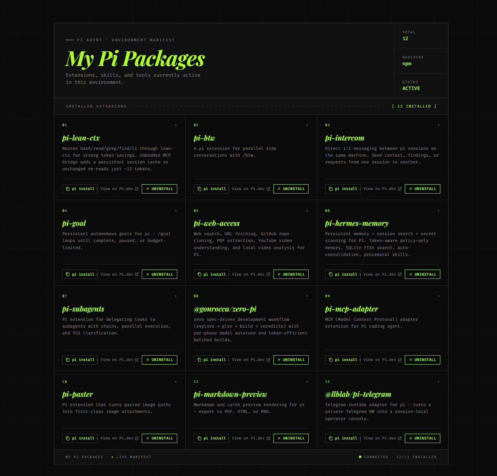
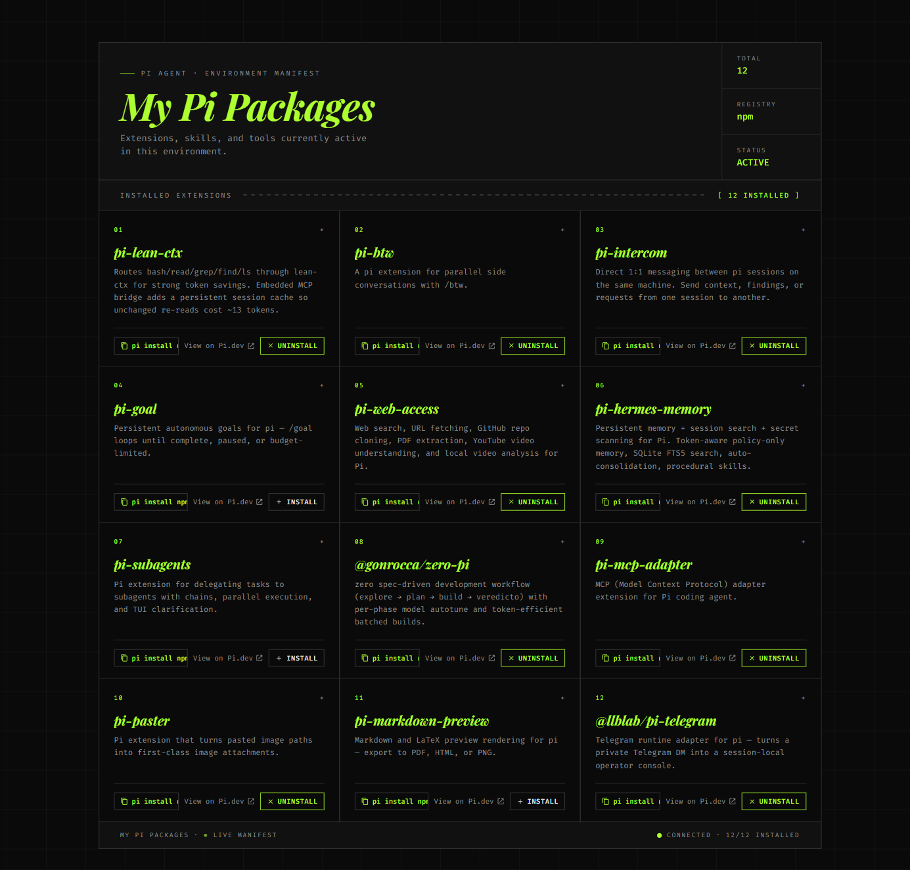
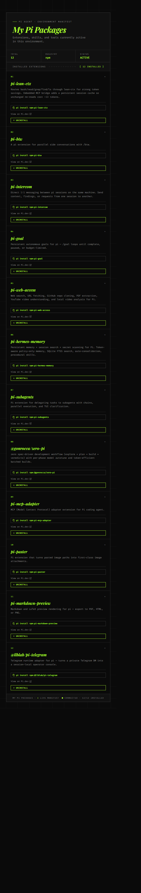

# pi-package-manager

Installed packages manager for [pi](https://pi.dev) — a blueprint-style web dashboard for browsing, installing, and removing pi packages from your agent.


## Preview

The dashboard lists every installed package and lets you install, uninstall, or copy the install command with one click.



When a package isn't on the machine yet, the action button flips to a neutral **Install** state; when it is, it switches to a brand-green **Uninstall** state. You can mix the two in the same view.



The blueprint layout collapses gracefully on narrow viewports — the meta rail folds into a row, package cards stack, and the action buttons stretch full-width.



## What it does

Adds two slash commands to your pi agent:

- **`/packages`** — opens the local dashboard at <http://127.0.0.1:7878/> showing your installed packages with one-click install/uninstall
- **`/packages-stop`** — stops the dashboard server (the agent also stops it on session end)

The dashboard is a self-contained HTML page that lists your installed extensions and lets you install or remove any npm-published pi package directly from the browser. No terminal round-trips, no copy-paste.

## Install

```bash
pi install npm:pi-package-manager
```

That's it — restart the agent and `/packages` is registered.

### Requirements

- Node.js ≥ 18
- `pi` CLI on your `PATH` (you have this if pi is installed)
- A modern browser to view the dashboard

## Usage

### Inside the pi agent

```
/packages
```

Spawns the bridge server in the background and opens the dashboard. Subsequent invocations are instant (the server is reused).

### From a terminal (no agent)

```bash
# Server + open browser
npx pi-package-manager

# Server only
npx pi-package-manager --no-open

# Custom port
npx pi-package-manager --port 9000
```

## How it works

1. The `/packages` slash command resolves the bundled `src/server.mjs` path and spawns `node` against it
2. The server binds `127.0.0.1:7878` (or whatever `PI_PACKAGES_PORT` is set to) and serves the dashboard HTML
3. The dashboard probes `/api/state` to read the recipient's installed packages from `~/.pi/agent/settings.json`
4. Clicking **Install** or **Uninstall** POSTs to `/api/install` or `/api/uninstall`, which shells out to the real `pi install` / `pi remove` commands
5. On `session_shutdown`, the extension kills the server process

### HTML resolution

The server picks the dashboard HTML in this order:

1. `$PI_PACKAGES_HTML` env var (explicit override)
2. `~/.pi/agent/pi-packages.html` — your personal copy (if it exists)
3. `src/pi-packages.html` — the bundled copy that ships with the package

This means the personal regen flow (`update_pi_packages.py`) still works: the dashboard always shows your latest local catalog, even if you installed the package long ago.

### API Endpoints

| Endpoint | Method | Description |
|----------|--------|-------------|
| `/` | GET | Serves the dashboard HTML |
| `/api/state` | GET | Returns installed packages from `settings.json` |
| `/api/health` | GET | Server health check |
| `/api/install` | POST | Install a package (`{ "source": "npm:<name>" }`) |
| `/api/uninstall` | POST | Uninstall a package (`{ "source": "npm:<name>" }`) |

### Security

- Bound to `127.0.0.1` only — never reachable from the network
- Source strings validated against a strict regex before reaching the shell: `/^npm:@?[a-z0-9][\w.-]*(\/[a-z0-9][\w.-]*)?$/i`
- 180-second timeout on install/uninstall operations
- CORS headers allow the page to be opened as `file://` for offline use

## Structure

```
pi-package-manager/
├── extensions/
│   └── index.ts          # Pi extension entry point — /packages command
├── src/
│   ├── server.mjs        # Bridge server (zero dependencies)
│   └── pi-packages.html  # Dashboard UI
├── bin/
│   └── pi-package-manager.mjs  # CLI entry point (npx / global)
├── package.json
├── LICENSE
├── tsconfig.json
└── README.md
```

## License

MIT
